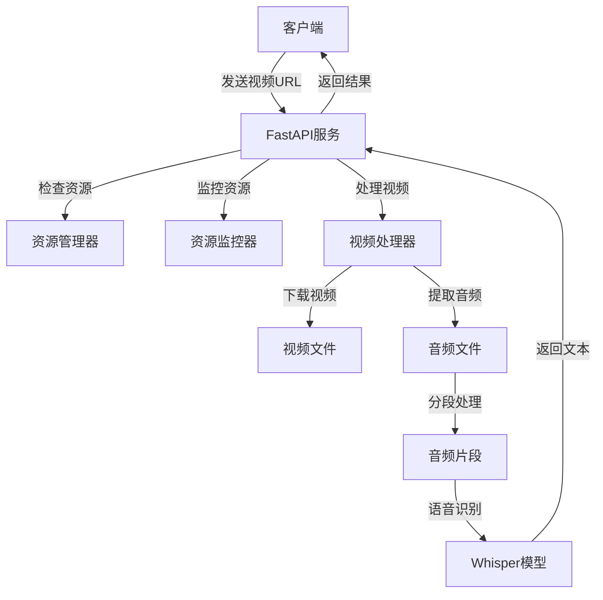
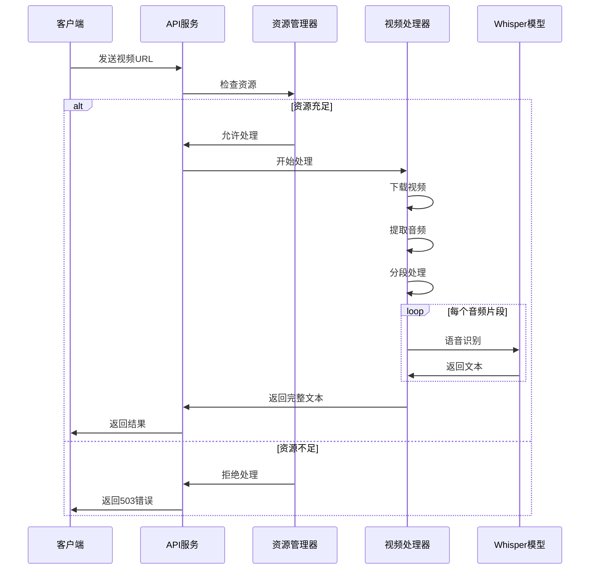
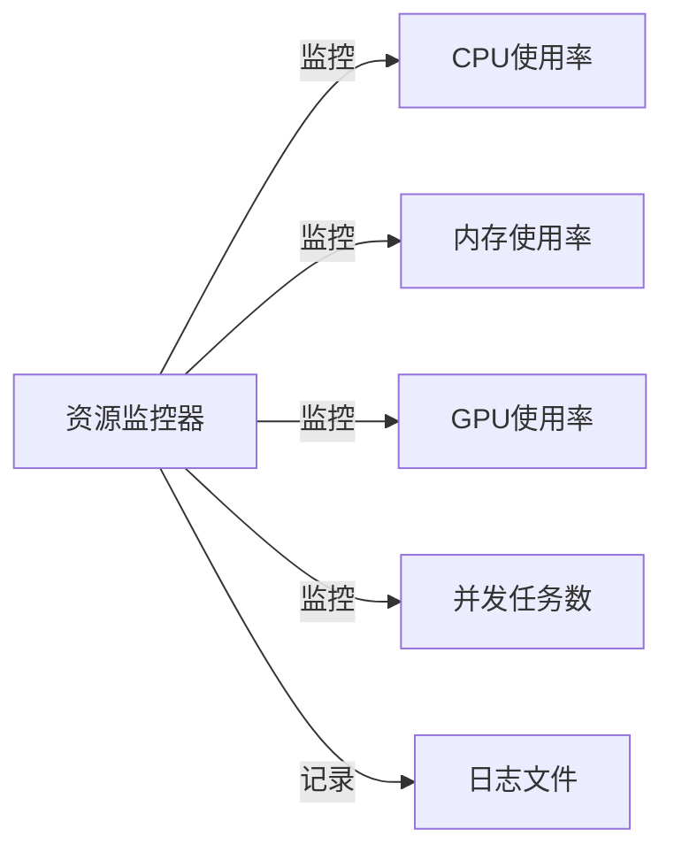
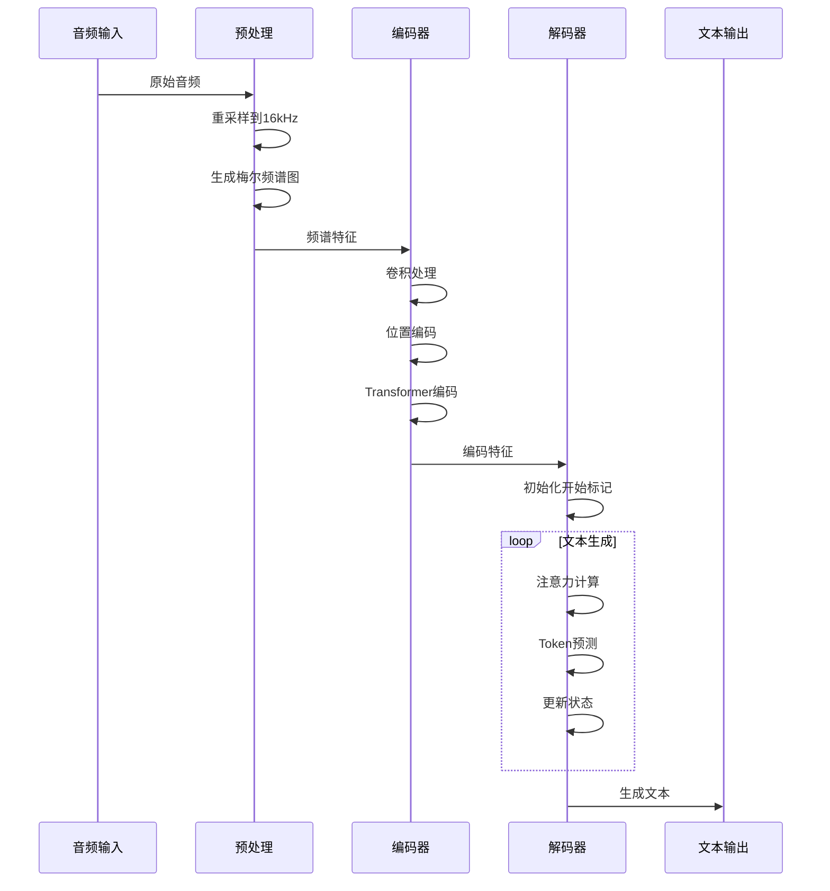

# 视频字幕提取工具

这是一个基于 Whisper 模型的视频字幕提取 API 服务，可以从视频文件中提取语音并转换为文字。支持长视频处理，自动分段识别，并具有资源管理和监控功能。

## 目录
- [功能特点](#功能特点)
- [系统架构](#系统架构)
- [处理流程](#处理流程)
- [资源监控](#资源监控)
- [快速开始](#快速开始)
- [API接口说明](#api-接口说明)
- [开发指南](#开发指南)
- [测试](#测试)
- [性能优化](#性能优化)
- [语音识别技术对比](#语音识别技术对比)
- [Whisper模型技术原理](#whisper-模型技术原理)
- [常见问题](#常见问题)

## 系统架构


## 处理流��


## 资源监控


## 快速开始

### 环境要求
- Python 3.8+
- FFmpeg
- CUDA支持（可选，用于GPU加速）
- 足够的磁盘空间用于临时文件

### 安装步骤
1. 克隆仓库
```bash
git clone <repository_url>
cd video-subtitle-extractor
```

2. 创建虚拟环境
```bash
python -m venv .venv
source .venv/bin/activate  # Linux/Mac
# 或
.venv\Scripts\activate  # Windows
```

3. 安装依赖
```bash
pip install -r requirements.txt
```

4. 配置代理（可选）
编辑 config.py 文件：
```python
PROXY = "http://your-proxy:port"  # 设置为你的代理
```

### 快速使用
1. 启动服务器
```bash
python api_server.py
```

2. 使用API
```python
from api_client import submit_video_task, check_system_status

# 提交视频处理任务
result = submit_video_task("http://example.com/video.mp4")
print(result)

# 检查系统状态
status = check_system_status()
print(status)
```

## API 接口说明

### 1. 提交视频处理请求
```http
POST /video-to-text
Content-Type: application/json

{
    "video_url": "http://example.com/video.mp4",
    "proxy": "http://proxy.example.com:8080"  // 可选
}
```

### 2. 查询系统状态
```http
GET /system-status
```

## 资源管理配置
可以通过修改 ResourceThreshold 配置资源使用阈值：
- max_cpu_percent: CPU使用率阈值（默认80%）
- max_memory_percent: 内存使用率阈值（默认80%）
- max_gpu_percent: GPU使用率阈值（默认80%）
- max_concurrent_tasks: 最大并发任务数（默认4）

## 开发指南

### 项目结构
```
.
├── api_server.py          # API服务器实现
├── api_client.py          # API客户端
├── video_processor.py     # 视频处理核心逻辑
├── video_downloader.py    # 视频下载模块
├── config.py             # 配置文件
├── utils/
│   ├── logger.py         # 日志工具
│   ├── resource_monitor.py # 资源监控
│   └── resource_manager.py # 资源管理
├── tests/                # 测试用例
└── requirements.txt      # 项目依赖
```

### 核心模块说明
1. **VideoSubtitleExtractor**: 视频字幕提取器
   - 支持视频下载
   - 音频提取
   - 分段处理
   - 文本后处理

2. **ResourceManager**: 资源管理器
   - CPU/内存/GPU 使用率监控
   - 并发任务控制
   - 资源阈值管理

3. **TextPostProcessor**: 文本后处理器
   - 标点符号优化
   - 错别字修正
   - 格式规范化

## 测试

### 运行测试
```bash
# 运行所有测试
pytest

# 运行特定测试
pytest tests/test_video_processor.py
pytest tests/test_performance.py
```

### 测试覆盖范围
- 单元测试
- 性能测试
- 内存泄漏测试
- 并发测试
- 错误处理测试

## 性能优化

### 已实现的优化
1. 视频处理
   - 分段处理长视频
   - 并发处理音频片段
   - 自动资源管理

2. 下载优化
   - 分片下载
   - 断点续传
   - 并发下载控制

3. 内存管理
   - 自动清理临时文件
   - 资源使用监控
   - 内存泄漏防护

## 语音识别技术对比

### 1. 主流语音识别技术对比
| 特性 | Whisper | Google Speech-to-Text | 阿里云ASR | 讯飞开放平台 |
|------|----------|---------------------|-----------|------------|
| 开源性 | 开源 | 闭源 | 闭源 | 闭源 |
| 部署方式 | 本地/云端 | 仅云端 | 仅云端 | 仅云端 |
| 定价 | 免费 | 按使用量付费 | 按使用量付费 | 按使用量付费 |
| 多语言支持 | 99种语言 | 120+种语言 | 14种语言 | 20+种语言 |
| 准确率 | 较高 | 很高 | 很高 | 很高 |
| 实时性 | 较低 | 高 | 高 | 高 |
| 离线使用 | 支持 | 不支持 | 不支持 | 不支持 |
| API集成 | 简单 | 中等 | 中等 | 中等 |

### 2. 技术特点详细对比

#### Google Speech-to-Text
- **优点**：
  - 准确率极高
  - 支持实时转写
  - 自动语言检测
  - 自动标点符号
  
- **缺点**：
  - 付费服务
  - 需要网络连接
  - API 配额限制
  - 无法本地部署

#### 阿里云 ASR
- **优点**：
  - 针对中文优化
  - 支持行业专用模型
  - 实时转写性能好
  - 提供丰富的 API
  
- **缺点**：
  - 收费较高
  - 语言支持有限
  - 依赖云服务
  - 隐私保护有限

#### 讯飞开放平台
- **优点**：
  - 中文识别准确率高
  - 方言支持丰富
  - 垂直领域优化
  - 实时性好
  
- **缺点**：
  - 商业收费
  - 需要联网使用
  - API 调用限制
  - 无法私有部署

### 3. 应用场景对比

#### 适合使用 Whisper 的场景
- 需要本地部署的场景
- 对隐私要求高的项目
- 多语言混合识别
- 离线批量处理
- 预算有限的项目

#### 适合使用商业云服务的场景
- 需要实时转写
- 企业级应用
- 要求极高准确率
- 有专项预算
- 特定行业应用

### 4. 选择 Whisper 的原因
本项目选择 Whisper 作为核心技术的原因：
1. **开源免费**：降低项目成本
2. **本地部署**：保护数据隐私
3. **多语言支持**：满足多样化需求
4. **社区活跃**：持续优化改进
5. **易于集成**：简化开发流程
6. **离线使用**：不依赖网络环境

## Whisper 模型技术原理

### 2. 核心技术细节

#### 2.1 音频预处理
- **采样率标准化**: 16kHz
- **频谱图生成**:
  - 使用短时傅里叶变换(STFT)
  - 80个梅尔滤波器组
  - 25ms窗口大小
  - 10ms步长

#### 2.2 模型结构
- **编码器**:
  ```
  1. 音频 -> 对数梅尔频谱图
  2. 卷积层处理: 降采样和特征提取
  3. 位置编码: 添加时序信息
  4. Transformer编码器层: 提取深层特征
  ```

- **解码器**:
  ```
  1. 文本嵌入层
  2. Transformer解码器层
  3. 交叉注意力机制: 关联音频和文本
  4. 自回归生成: 逐个生成文本token
  ```

#### 2.3 训练策略
- **多任务学习**:
  - 语音识别
  - 语言识别
  - 声音分类
  - 时间戳预测

- **数据增强**:
  - 时间拉伸
  - 频率掩码
  - 时间掩码
  - 噪声注入

### 3. 工作流程


### 4. 关键优化技术

#### 4.1 注意力机制优��
- **稀疏注意力**: 减少计算复杂度
- **局部注意力窗口**: 处理长序列
- **交叉注意力对齐**: 音频-文本对齐

#### 4.2 推理优化
- **批处理**: 并行处理多个音频片段
- **长音频分段**: 自动分割长音频
- **时间戳对齐**: 准确的时间戳生成
- **缓存优化**: 重用计算结果

#### 4.3 性能优化
- **量化**: INT8/FP16精度
- **模型剪枝**: 减少模型大小
- **KV缓存**: 加速自回归生成
- **批处理动态调整**: 根据设备性能调整

### 5. 技术优势
1. **端到端训练**:
   - 无需独立的声学模型和语言模型
   - 简化训练和部署流程

2. **多语言能力**:
   - 支持99种语言
   - 零样本跨语言迁移
   - 自动语言检测

3. **鲁棒性**:
   - 对噪声具有较强抵抗力
   - 适应不同说话人和口音
   - 处理各种音频质量

4. **可扩展性**:
   - 模型大小可选（tiny到large）
   - 支持自定义微调
   - 易于集成和部署

## 常见问题

### 1. 安装问题
Q: 安装依赖时出现错误  
A: 确保已安装 Python 3.8+ 和 FFmpeg，可能需要设置代理

### 2. 运行问题
Q: 提示资源不足  
A: 检查 config.py 中的资源阈值设置，适当调整

### 3. 性能问题
Q: 处理大视频很慢  
A: 考虑使用 GPU 加速，调整分段大小

## 更新日志

### v1.0.0
- 初始版本发布
- 基本功能实现
- 完整的测试套件

## 贡献指南

1. Fork 项目
2. 创建特性分支
3. 提交更改
4. 推送到分支
5. 创建 Pull Request

## 许可证

[添加许可证信息]

## 安装说明

1. 确保你的系统已安装 Python 3.x
2. 克隆或下载本项目到本地
3. 使用以下命令安装依赖：   ```bash
   # 方法1：直接安装
   pip install -r requirements.txt

   # 如果上述命令失败，请尝试：
   python -m pip install -r requirements.txt   ```

注意：如果安装过程中遇到编码错误，请确保 requirements.txt 文件使用 UTF-8 编码保存。